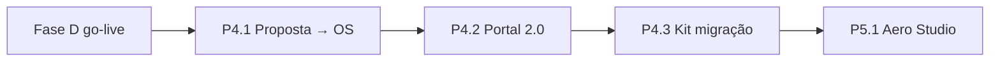

# Portal cliente 2.0 + Proposta → OS

Especificação funcional para **P4.1** e **P4.2** do [ROADMAP-DIFERENCIACAO-MRO.md](./ROADMAP-DIFERENCIACAO-MRO.md).

**Killer feature #1 (recomendado primeiro):** **Proposta → OS** — maior impacto imediato na operação e na narrativa de venda (“da cotação ao hangar sem re-digitar”).

---

## Estado atual no repositório (baseline)

### Portal externo (já existe)

| Área | Rota / API | Ficheiros-chave |
|------|------------|-----------------|
| Login externo | `/externo/login`, `/api/auth-externo/*` | `externo-login`, `AuthExternoResource` |
| Layout autenticado | `/externo/*` | `externo-layout.component` |
| Lista / detalhe OS | `/externo/os`, `/externo/os/:id` | `externo-os-list`, `externo-os-detail` |
| Documentos | `/externo/documentos` | `externo-documentos` |
| Perfil | `/externo/perfil` | `externo-perfil` |
| Gestão interna | `/usuarios-externos` | `UsuarioExterno`, RBAC `usuarios-externos` |

**Limitações hoje:**

- Cliente **vê** OS e documentos; **não** vê propostas comerciais nem aprova trabalhos adicionais no fluxo digital.  
- Utilizador externo **não pode criar OS** (`OSResource.create` bloqueia `UsuarioExterno` — correto para Part 145).  
- **Não há** vínculo `proposta_comercial` ↔ `os` na base de dados.

### Proposta comercial (já existe)

| Capacidade | Onde |
|------------|------|
| CRUD, itens, status, PDF, e-mail, WhatsApp | `PropostaComercialService`, `proposta-comercial.component` |
| Cliente proposta | `ClienteProposta`, autocomplete na proposta |
| Bling import | `GET /api/integracoes/bling/contatos` (P3) |

**Limitação crítica:** aprovar proposta **não** gera OS automaticamente.

---

## Parte A — P4.1 Proposta → OS (killer #1)

### A.1 Objetivo

Quando uma proposta passa a status **`APROVADA`** (ou ação explícita **“Gerar OS”**), o sistema:

1. Cria uma **OS** pré-preenchida com dados do cliente, aeronave/FCU (se informados na proposta), itens de serviço mapeados.  
2. Grava **vínculo bidirecional** proposta ↔ OS.  
3. Opcionalmente **reserva** componentes de estoque (fase A.1b se complexo).  
4. Notifica responsáveis internos (notificação existente / e-mail).

### A.2 Regras de negócio

| Regra | Detalhe |
|-------|---------|
| Quem pode gerar | Utilizador interno com `propostas-comerciais` + `os` (ou perfil comercial/admin) |
| Uma proposta → N OS? | **1:1** no MVP (uma OS por proposta); aditivos = nova proposta ou “revisão” v1.1 |
| OS já existe? | Botão desabilitado; mostrar link “OS #123” |
| Status proposta | Só `APROVADA` ou `ENVIADA`+confirmação manual — definir enum único `APROVADA` |
| Cliente | Copiar `clienteNome`, contactos de `ClienteProposta` se `clientePropostaId` |
| Itens | Mapear linhas da proposta para linhas de serviço / observação na OS (texto); não duplicar motor de preço da OS se diferente |
| FCU | Se proposta tiver PN/serial/modelo (campos existentes ou extensão mínima), tentar match `Fcu` por PN; senão OS sem FCU com alerta |
| Auditoria | Registar `proposta_os_geracao` em log (quem, quando, ids) |

### A.3 Modelo de dados (Flyway)

```sql
-- V20__proposta_os_link.sql (número ilustrativo; usar próximo livre na implementação)

ALTER TABLE proposta_comercial
  ADD COLUMN os_id BIGINT NULL,
  ADD COLUMN os_gerada_em DATETIME NULL,
  ADD COLUMN os_gerada_por VARCHAR(100) NULL,
  ADD CONSTRAINT fk_proposta_os FOREIGN KEY (os_id) REFERENCES os(id);

CREATE INDEX idx_proposta_os_id ON proposta_comercial(os_id);
```

Alternativa normalizada (se preferirem N:N no futuro): tabela `proposta_comercial_os_link`. Para MVP, coluna em `proposta_comercial` basta.

### A.4 API

| Método | Path | Descrição |
|--------|------|-----------|
| `POST` | `/api/propostas-comerciais/{id}/gerar-os` | Gera OS; retorna `OSDto` + `proposta` atualizada |
| `GET` | `/api/propostas-comerciais/{id}` | Incluir `osId`, `osResumo` (número, status) |

**Serviço:** `PropostaComercialOsBridgeService` (ou método em `PropostaComercialService`) chama `OSService.create` com DTO montado — **transacional**.

### A.5 UI (Angular)

- Botão na proposta (toolbar): **“Gerar ordem de serviço”** (`comercial.proposta.btn.gerarOs`).  
- Confirmação modal: resumo do que será copiado.  
- Após sucesso: toast + link **Abrir OS**.  
- Na lista de propostas: coluna / ícone “OS vinculada”.  
- Na OS (detalhe): badge **“Origem: Proposta PC-2026-001”** com link.

### A.6 i18n

Chaves `comercial.proposta.gerarOs.*` nas 4 línguas (mesmo padrão `commercial-proposta-i18n.ts`).

### A.7 Testes

| Tipo | Caso |
|------|------|
| Unit | Montagem DTO proposta → OS; proposta já com `osId` → 409 |
| API smoke | `POST .../gerar-os` após criar proposta demo |
| E2E | Aprovar proposta → gerar OS → abrir OS com mesmo cliente |

### A.8 Critério de aceite

- [x] Utilizador gera OS a partir de proposta aprovada em &lt; 3 cliques após preencher proposta.  
- [x] Dados do cliente visíveis na OS sem reentrada.  
- [x] Proposta e OS navegáveis entre si (`/os?editId=` + coluna/lista).  
- [x] Operação idempotente: segundo clique não cria segunda OS (409).

**Implementado em código:** Flyway `V20`, `PropostaComercialOsBridgeService`, `POST /api/propostas-comerciais/{id}/gerar-os`, UI proposta + lista.

**Estimativa:** 3–4 semanas.

---

## Parte B — P4.2 Portal cliente 2.0

### B.1 Objetivo

Dar ao **cliente externo** visibilidade do ciclo **proposta → OS → conclusão**, com aprovações claras e menos e-mail/telefone.

### B.2 Funcionalidades MVP

| # | Funcionalidade | Descrição |
|---|----------------|-----------|
| B2.1 | **Minhas propostas** | Lista propostas do `clienteProposta` ligado ao utilizador externo (ou e-mail) |
| B2.2 | **Detalhe proposta** | PDF/resumo, status, valor, validade |
| B2.3 | **Aprovar / rejeitar** | Com motivo; atualiza status; dispara evento interno (notificação) |
| B2.4 | **Ver OS vinculada** | Se proposta gerou OS (P4.1), timeline de status da OS (somente leitura) |
| B2.5 | **Upload documentos na proposta** | ANAC/formulários antes da aprovação |
| B2.6 | **Aprovação de aditivo** | **v1.1 feito** — aditivos/anexos no portal externo; oficina regista aditivos e consulta anexos na aba **Portal** da proposta interna (`V42`, `GET/POST .../propostas-comerciais/{id}/aditivos`, `GET .../anexos`) |

### B.3 Modelo de acesso

- Ligar `UsuarioExterno` ↔ `ClienteProposta` (pode já existir campo — validar em `UsuarioExterno`).  
- Filtro: `proposta_comercial.cliente_proposta_id IN (...)` ou match e-mail.  
- RBAC: rotas `/api/auth-externo/propostas/*` read-only + `POST .../aprovar` / `.../rejeitar`.

### B.4 UI externa

| Rota | Ecrã |
|------|------|
| `/externo/propostas` | Lista |
| `/externo/propostas/:id` | Detalhe + ações aprovar/rejeitar |
| `/externo/os/:id` | Melhorar timeline (status, datas, “aguardando peças”) |

Branding: `BrandingService` + `?tenant=` (já P1).

### B.5 Notificações

- E-mail interno quando cliente aprova/rejeita (template existente de mailer).  
- Opcional: WhatsApp para comercial (reuso infra proposta).

### B.6 Dependências

- **P4.1** recomendado antes ou em paralelo (portal mostra OS gerada).  
- Status de proposta estáveis: `RASCUNHO`, `ENVIADA`, `APROVADA`, `REJEITADA`, `EXPIRADA`.

### B.7 Critério de aceite

- [x] Cliente externo vê apenas propostas/OS da sua empresa (match e-mail / empresa + tenant).  
- [x] Aprovação registada com data, IP, user-agent (`cliente_decisao_*` + `LogAcessoExterno`).  
- [x] Chefe de oficina interno vê aprovação no detalhe da proposta (banner na UI interna).

**Implementado em código:** Flyway `V21`, `PropostaExternaPortalService`, rotas `/api/auth-externo/me/{id}/propostas/*`, UI `/externo/propostas`.

**Estimativa:** 4–5 semanas (após ou paralelo a P4.1).

---

## Ordem de implementação sugerida



1. **P4.1** — valor imediato no hangar; demo de vendas forte.  
2. **P4.2** — reduz churn e chamadas do cliente.  
3. P4.3 / P4.4 em paralelo comercial.

---

## Referência competitiva (comportamento, não cópia)

Portais enterprise (ex. Sensus Customer Portal) enfatizam: status por fase, aprovação de job card, histórico de horas aprovadas. Aero Suite foca **SME LATAM**: menos módulos, mais integração com proposta/estoque já construídos.

---

## Documentos a atualizar ao concluir P4

- `IMPLEMENTACAO-PLANO-SAAS.md` — linha proposta↔OS.  
- `validacao-usuario-externo.md` — novos fluxos portal.  
- `api-comercial-smoke.ps1` — `POST gerar-os` (opcional).  
- OpenAPI annotations nos novos endpoints.
